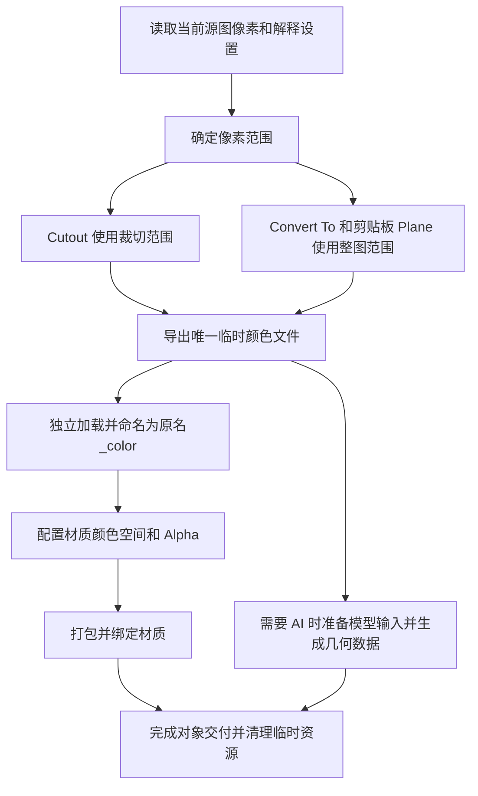

## Context

动机与范围见 proposal.md。普通 Cutout 在内存中新建颜色图，AI Cutout 从裁切临时文件加载；Convert To 使用按 Empty 引用决定复用的分支。剪贴板通过输入字节哈希查找 packed Image，编辑覆盖原 Image 后该标记仍然存在。

## Goals / Non-Goals

设计目标是让所有材质入口共享范围采样和颜色图交付逻辑，并让剪贴板按当前图像状态验证缓存。输入范围统一使用现有像素坐标约定，静态颜色图以独立 packed Image 交付。

## Decisions

### 1. 统一范围与颜色文件准备

公共准备逻辑放在 common，输入源 Image、当前像素及范围。复用现有像素读取、路径清理和 packed 加载能力；由临时产物携带采样时的尺寸与解释设置，异步响应使用同一次准备的内容。AI 和普通 Cutout 采用相同裁切颜色来源，模型推理的缩放或预览处理只作用于分析输入。

### 2. 独立加载是材质所有权边界

每次材质创建都从本次临时颜色文件使用 `check_existing=False` 加载新的 Color Image。名称使用源图基名、`_color` 和实际编码后缀，由 Blender 处理重名。文件位于本次操作的唯一临时目录，与原图路径分离。

材质构建函数接收已准备好的独立 Color Image，负责配置和节点绑定。所有入口在进入该函数前完成相同准备；Cutout 已准备的产物直接交付。原 Image 的像素、名称、路径、颜色空间和 Alpha 保持原值。材质 Image 由文件独立加载，因此不继承源 Image 的剪贴板缓存属性。

### 3. 编码精度与颜色解释共同验证

普通 byte 图片使用无损 PNG；float / HDR 使用保留浮点范围和精度的 EXR。复用 common 中适合的 HDR 编码能力，按源 Alpha 解释正确处理关联 RGB 和透明区域颜色。

普通 byte 材质沿用适配偏好、inverse 空间映射与 sRGB 回退。所有 float / HDR 材质保留源颜色空间与 Alpha 模式；Panorama 保留现有非 sRGB 规则。导出、独立加载、配置、打包和保存重载作为完整往返验证。普通 float 不再强制套用显示颜色空间，原有重载 xfail 改为源解释保留的正常回归测试。

float / HDR 在导出后按源解释独立加载并比较像素。STRAIGHT 按 Alpha 解关联后编码；源解释与 EXR 无法同时保留像素时明确拒绝转换并清理临时目录，例如 STRAIGHT 下完全透明像素仍含非零 RGB。float 材质不启用场景视图适配的 Alpha Fix。

### 4. 临时产物由操作持有

同步操作持有临时目录直至 Color 完成打包和对象交付；异步操作持有颜色产物及分析输入直至响应、取消或失败处理完成。静态普通颜色文件适合作为模型输入时复用同一临时文件；HDR 分析预览保留独立路径。所有清理入口按真实持有关系释放资源，packed Color 在临时文件删除后仍可保存和重载。

转换源对象与 Image 身份校验继续使用；材质隔离后清理原图复用及相应的原图配置恢复、打包撤销基线分支。保留对象、材质、网格和临时 Image 的异常清理及转换 Undo / Redo。

### 5. 剪贴板缓存验证实际内容

输入字节的 SHA256 继续作为候选索引。首次加载 packed Image 后保存其内容指纹：尺寸、统一读取的 RGBA 像素、颜色空间及 Alpha 模式。命中输入哈希时重新计算当前指纹，匹配才复用；不匹配、缺少指纹或无法读取时跳过该候选，从剪贴板原始字节重新创建。

指纹在稳定的像素读取约定下计算，包含完全透明像素的 RGB。使用前验证能同时覆盖 Mask、Frame、Rectify、AI 编辑与原生绘制，避免依赖每个编辑入口主动通知。`is_dirty` 不能代表内容是否仍相同，packed 的编辑结果也必须验证。

剪贴板粘贴为参考图、节点或笔刷时沿用有效原图缓存；粘贴为 Plane 材质时基于该原图按整图范围创建独立颜色产物。旧缓存缺少指纹时按未命中处理，无需迁移用户图像。

### 6. Plane 收紧为静态图片

在创建材质或临时文件前拒绝 Movie、Sequence 及其他动画输入，明确报告仅支持静态图。移除 Plane 的帧起点、偏移、时长及循环传递，并沿调用链清理仅供材质动画使用的参数。其他图片编辑功能仍按各自输入约定运行。

## Risks / Trade-offs

- [PNG / EXR 往返改变 RGB 或 Alpha 解释] → 覆盖 byte、float、HDR、透明 RGB、dirty、generated 和 packed 来源，检查配置前后与保存重载结果。
- [全图内容指纹存在读取成本] → 先以剪贴板输入哈希筛选，仅验证匹配候选，复用 common 的无副作用像素读取。
- [临时文件被提前删除] → 操作持有文件直至模型输入使用结束与材质打包完成，测试取消和失败路径。
- [旧复用测试与当前要求冲突] → 以本提案的独立 Color 规格更新行为断言，保留有效错误恢复覆盖。

## Migration Plan

先实现并验证公共颜色产物，再接入 Cutout、Convert To 与剪贴板 Plane；补充缓存指纹校验，移除被替换的原图复用分支和重复实现。仅对后续操作采用新规则，已有场景数据保留。更新相关测试并运行全量测试，确认旧引用清理和正常退出。
