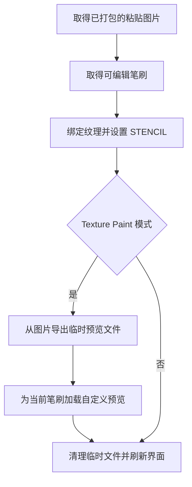

## Context

`set_tool_texture()` 先取得可编辑笔刷，再绑定图片纹理、设置 STENCIL 和颜色。外部库笔刷通过 `asset_save_as` 创建并激活本地副本；已有可编辑笔刷直接复用。剪贴板图片已打包，加载时的临时文件随即删除。

## Goals

在 Texture Paint 粘贴流程中，让当前笔刷预览与绑定图片一致，保持图片比例，并随当前文件保存。

## Decisions

### 在纹理绑定成功后更新本地笔刷预览

更新入口保留在 `clipboard_image/actions.py`，以 `PAINT_TEXTURE` 判断模式，使用 `_ensure_editable_brush()` 返回的笔刷。所有 Blender 数据操作在 Operator 主线程阶段完成。

### 使用 Blender 自定义预览加载能力

复用 `common` 中适合的图片导出函数，生成临时 PNG，通过覆盖上下文的 `id` 指向目标笔刷，调用 `bpy.ops.ed.lib_id_load_custom_preview`。由 Blender 生成缩略图，保持比例与透明区域。预览加载完成后清理临时文件，预览数据由笔刷保存。

### 单独处理预览更新失败

预览更新与已有纹理绑定异常处理分开。加载失败时保留已绑定纹理和可用笔刷，通过现有 Operator 报告渠道提示预览更新失败。临时文件在成功与失败路径均清理。

## Risks / Trade-offs

- 自定义预览 Operator 的上下文和界面缓存可能影响可见效果 → 在项目支持的 Blender 版本中验证当前笔刷选择器、资产架与切换笔刷后的显示。
- 图片导出可能影响色彩或源数据 → 复用图片导出能力，验证透明图和非正方形图，确保源图片像素、尺寸及打包状态保持。
- 预览保存行为需真实 Blender 验证 → 保存并重新打开 `.blend`，确认本地笔刷预览在临时文件清理后仍可显示。
